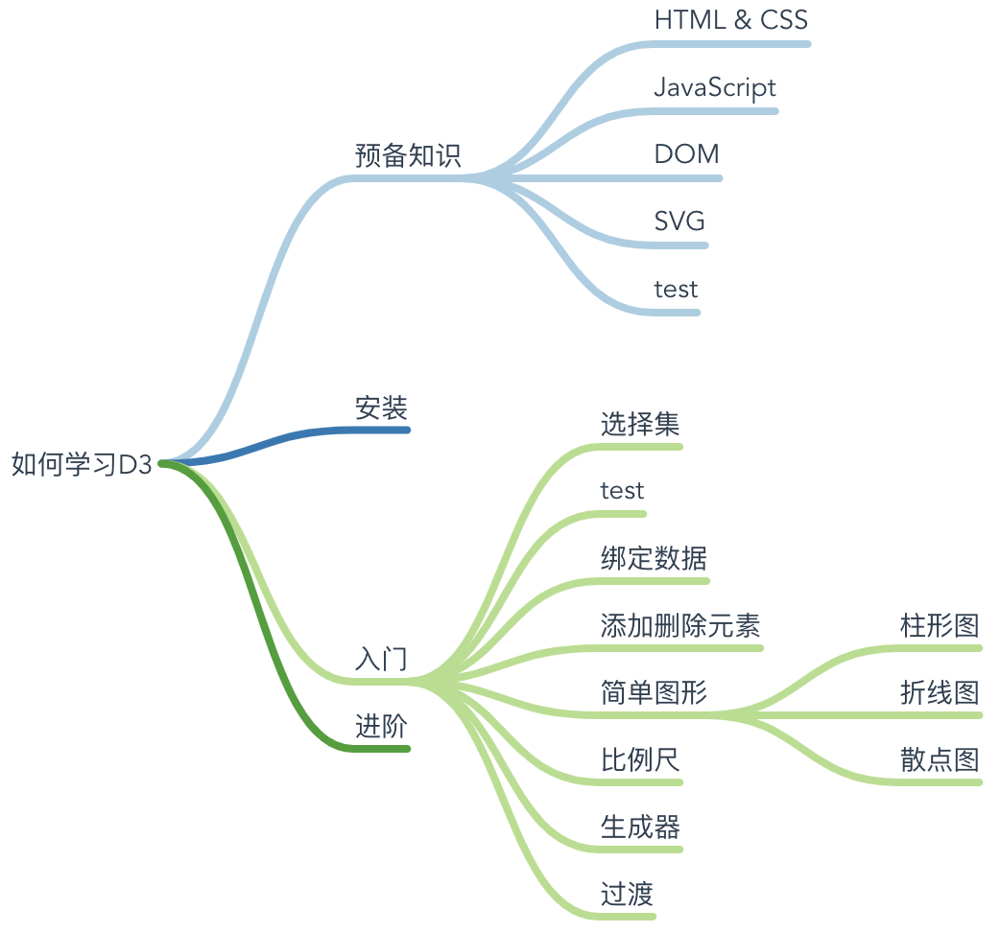

# Mindmap Vue Component

Make a mindmap component similar to [MindNode](https://mindnode.com)

[中文说明](./README.cn.md).

## Function

Support keyboard and mouse

- Drag
- Zoom
- Add, delete and edit node
- ...

## Usage

- tab - Add child node
- enter - Add siblings
- delete - Delete node
- right click - Open contextMenu
- click twice - Edit node content
- ...

Online demo：<https://mindnode.5xin.xyz>

## Install

```sh
npm install @hellowuxin/mindmap
```

```js
// In your vue file
import mindmap from '@hellowuxin/mindmap'
```

## API

| Name    | Type   | Default   | Description    |
| ---     | ---    | ---       | ---            |
| v-model | Array  | undefined | Set the data for the component.   |
| width   | Number | 700       | Set the width for the component.  |
| height  | Number | 700       | Set the height for the component. |

## Example

```html
<template>
  <div id="app">
    <mindmap
      v-model="data"
    ></mindmap>
  </div>
</template>

<script>
import mindmap from '@hellowuxin/mindmap'

export default {
  name: 'App',
  components: {
    mindmap
  },
  data: () => ({
    data: [{
      "name":"如何学习D3",
      "children":
      [
        {
          "name":"预备知识",
          "children":
          [
            {"name":"HTML & CSS", "children": []},
            {"name":"JavaScript", "children": []}
        },
        {
          "name":"安装",
          "children": []
        },
        ...
      ]
    }]
  })
}
</script>
```
