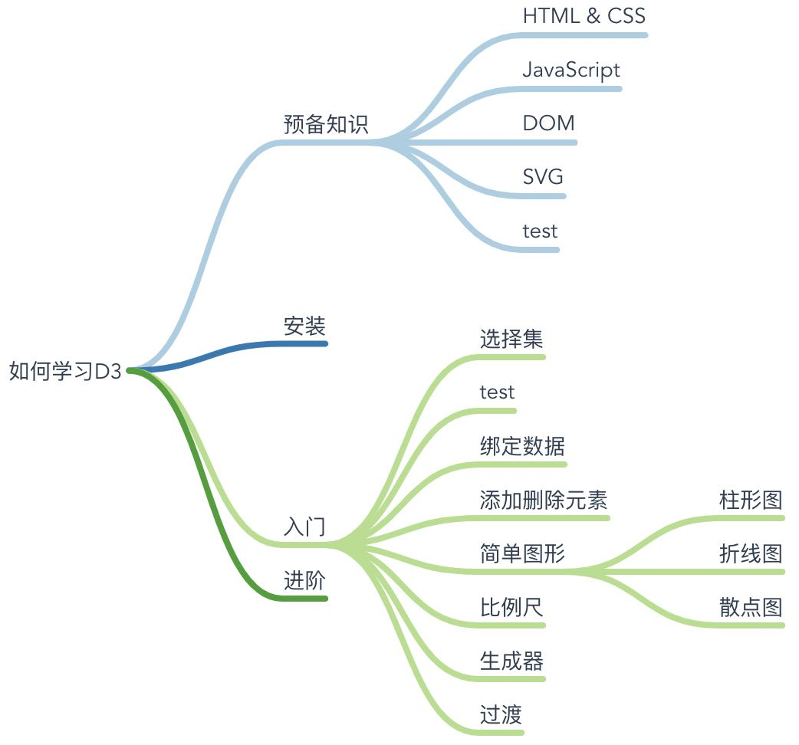

# Mindmap Vue Component


Based on d3.js

[中文说明](./README.cn.md)

Online demo：<https://blog.5xin.xyz/mycomponents/mindmap>

## Function

Support keyboard and mouse

- Drag
- Zoom
- Add, delete and edit node
- ...

## Usage

- tab - Add child node
- enter - Add siblings
- delete - Delete node
- right click - Open contextMenu
- click twice - Edit node content
- ...

## Install

```sh
npm install @hellowuxin/mindmap
```

```js
// In your vue file
import mindmap from '@hellowuxin/mindmap'
```

## API

| Name        | Type   | Default   | Description                                    |
| ---         | ---    | ---       | ---                                            |
| v-model     | Array  | undefined | Set up mindmap data                            |
| width       | Number | 100%      | Set component width                            |
| height      | Number | 100%      | Set component height                           |
| xSpacing    | Number | 80        | Set node horizontal spacing                    |
| ySpacing    | Number | 20        | Set node vertical spacing                      |
| draggable   | Boolean| true      | Set whether node is draggable                  |
| gps         | Boolean| true      | Whether to show center button                  |
| fitView     | Boolean| true      | Whether to show zoom button                    |
| showNodeAdd | Boolean| true      | Whether to show add-node button                |
| keyboard    | Boolean| true      | Whether to respond to keyboard event           |
| contextMenu | Boolean| true      | Whether to respond to contextMenu event        |
| nodeClick   | Boolean| true      | Set whether the node can be clicked and edited |
| zoomable    | Boolean| true      | Whether it can be zoomed or dragged            |

## Example

```html
<template>
  <div id="app">
    <mindmap
      v-model="data"
    ></mindmap>
  </div>
</template>

<script>
import mindmap from '@hellowuxin/mindmap'

export default {
  name: 'App',
  components: {
    mindmap
  },
  data: () => ({
    data: [{
      "name":"如何学习D3",
      "children":
      [
        {
          "name":"预备知识",
          "children":
          [
            {"name":"HTML & CSS", "children": []},
            {"name":"JavaScript", "children": []}
        },
        {
          "name":"安装",
          "children": []
        },
        ...
      ]
    }]
  })
}
</script>
```

## Todo

- [ ] Export multiple formats
- [ ] Set node width and height
- [ ] Multiple root nodes
- [ ] Collapse node
- [ ] ...
